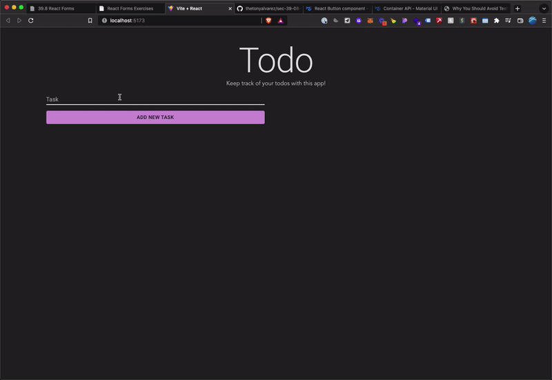

# Todo App

This app creates todo in a list and deletes todos.

This app uses [React](https://reactjs.org/docs/getting-started.html) and [Material UI](https://mui.com/) for front-end rendering, [Formik](https://formik.org/) for form handling, and [Yup](https://www.npmjs.com/package/yup) for form validation.
## Demo


## Installation and Deployment

To install and deploy this project run

```bash
  npm install
  npm run dev
```


## Running Tests

To run tests, run the following command

```bash
  npm test
```

